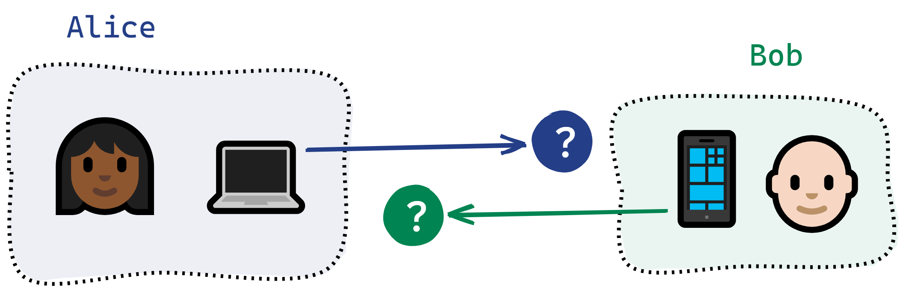
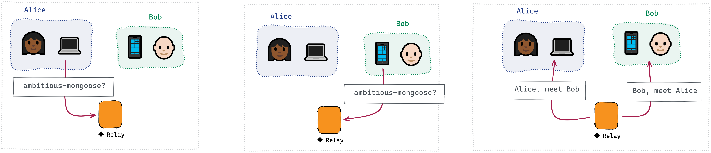
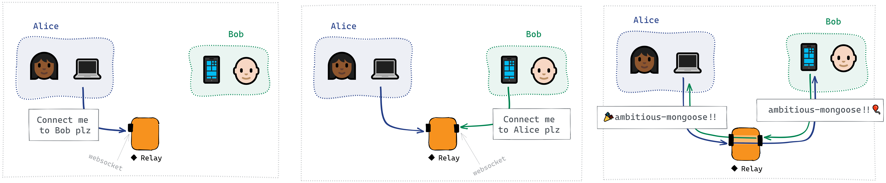
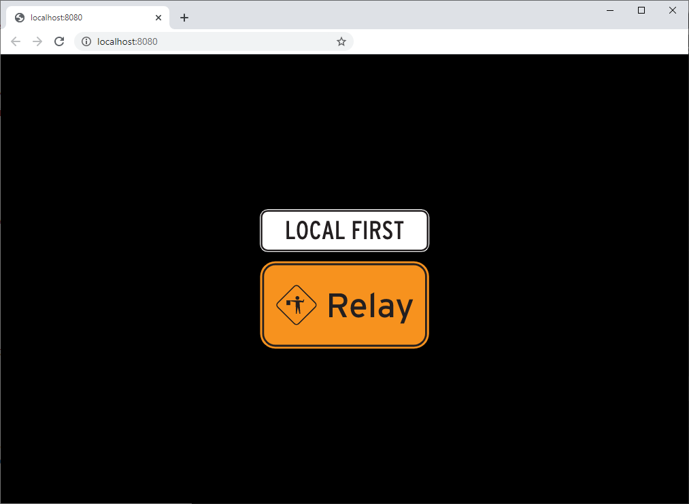

`@localfirst/relay` is a tiny service that helps local-first applications connect with peers on
other devices. It can run in the cloud or on any device with a known address.

Deploy to:
[Glitch](http://github.com/local-first-web/relay-deployable#deploying-to-glitch) |
[Heroku](http://github.com/local-first-web/relay-deployable#deploying-to-heroku) |
[AWS](http://github.com/local-first-web/relay-deployable#deploying-to-aws-elastic-beanstalk) |
[Google](http://github.com/local-first-web/relay-deployable#deploying-to-google-cloud) |
[Azure](http://github.com/local-first-web/relay-deployable#deploying-to-azure) |
[local server](http://github.com/local-first-web/relay-deployable#installing-and-running-locally)

## Why

</img>

Getting two end-user devices to communicate with each other over the internet is
[hard](https://tailscale.com/blog/how-nat-traversal-works/). Most devices don't have stable public
IP addresses, and they're often behind firewalls that turn away attempts to connect from the
outside. This is a **connection** problem.

Even within a local network, or in other situations where devices can be reached directly, devices
that want to communicate need a way to find each other. This is a problem of **discovery**.

## What

This service offers a solution to each of these two problems.

### 1. Introduction

Alice can provide one or more document documentIds that she's interested in. (A document documentId is a unique ID
for a topic or channel &mdash; it could be a GUID, or just a string like `ambitious-mongoose`.)

[](https://raw.githubusercontent.com/local-first-web/relay/master/images/relay-introduction.png)

If Bob is interested in the same documentId or documentIds, each will receive an `Introduction` message with the
other's userName. They can then use that information to connect.

### 2. Connection

Alice can request to connect with Bob on a given document documentId. If we get matching connection
requests from Alice and Bob, we pipe their sockets together.

[](https://raw.githubusercontent.com/local-first-web/relay/master/images/relay-connection.png)

## How

### Running locally

From this monorepo, you can run this server as follows:

```bash
$ yarn start
```

You should see something like thsi:

```bash
yarn run v1.22.4
$ yarn workspace @localfirst/relay start
$ node dist/start.js
🐟 Listening at http://localhost:8080
```

You can visit that URL with a web browser to confirm that it's working; you should see something like this:



### Deploying to the cloud

The recommended way to stand one of these up is to use the [relay-deployable] repo, which is
optimized for deployment.

See instructions for deploying to:
[Glitch](http://github.com/local-first-web/relay-deployable#deploying-to-glitch) |
[Heroku](http://github.com/local-first-web/relay-deployable#deploying-to-heroku) |
[AWS](http://github.com/local-first-web/relay-deployable#deploying-to-aws-elastic-beanstalk) |
[Google](http://github.com/local-first-web/relay-deployable#deploying-to-google-cloud) |
[Azure](http://github.com/local-first-web/relay-deployable#deploying-to-azure) |
[local server](http://github.com/local-first-web/relay-deployable#installing-and-running-locally)

### Usage

[@localfirst/relay-client], included in this repo, is a lightweight client library designed to be
used with this server.

> You don't strictly need to use this client - you could interact directly with the server the way we
> do in the [server tests] - but it automates the business of accepting invitations when they're
> received.

The client keeps track of all peers that the server connects you to, and for each peer it keeps
track of each documentId (aka discoveryKey, aka channel) that you're working with that peer on.

```ts
client = new Client({ userName: 'alice', url: 'myrelay.somedomain.com' })
  .join('ambitious-mongoose')
  .on('peer.connect', ({ documentId, userName, socket }) => {
    // `socket` is a WebSocket-Stream

    // send a message
    socket.write('Hello! 🎉')

    // listen for messages
    socket.on('data', message => {
      console.log(`message from ${userName} about ${documentId}`, message)
    })
  })
```

### Security

⚠ This server makes no security guarantees. Alice and Bob should probably:

1. **Authenticate** each other, to ensure that "Alice" is actually Alice and "Bob" is actually Bob.
2. **Encrypt** all communications with each other.

The [@localfirst/auth] library can be used with this relay service. It provides peer-to-peer
authentication and end-to-end encryption, and allows you to treat this relay (and the rest of the
network) as untrusted.

## Server API

> The following documentation might be of interest to anyone working on `@localfirst/relay-client`, or replacing it
> with a new client. You don't need to know any of this to interact with this server if you're using the included client.

This server has two WebSocket endpoints: `introduction` and `connection`.

### Introduction endpoint: `/introduction/:localId`

- I connect to this endpoint, e.g. `wss://myrelay.somedomain.com/introduction/alice`.

- `:localId` is my unique client identifier.

- Once a WebSocket connection has been made, I send an introduction request containing one or more
  document IDs I'm interested in joining:

  ```ts
  {
    type: 'Join',
    join: ['ambitious-mongoose', 'frivolous-platypus'], // documents I have or am interested in
  }
  ```

- If another peer is connected to the same server and interested in one or more of the same
  documents IDs, the server sends me an introduction message:

  ```ts
  {
    type: 'Introduction',
    userName: 'bob', // the peer's userName
    documentIds: ['ambitious-mongoose'] // documents we're both interested in
  }
  ```

- I can now use this information to request a connection to this peer via the `connection` endpoint:

### Connection endpoint: `/connection/:localId/:remoteId/:documentId`

Once I've been given a peer's ID, I make a new connection to this endpoint, e.g.
`wss://myrelay.somedomain.com/connection/alice/bob/ambitious-mongoose`.

- `:localId` is my unique client identifier.
- `:remoteId` is the peer's unique client identifier.
- `:documentId` is the document ID.

If and when the peer makes a reciprocal connection, e.g.
`wss://myrelay.somedomain.com/connection/bob/alice/ambitious-mongoose`, the server pipes their sockets
together and leaves them to talk.

The client and server don't communicate with each other via the `connection` endpoint; it's purely a
relay between two peers.

## License

MIT

## Prior art

Inspired by https://github.com/orionz/discovery-cloud-server

Formerly part of 🐟 Cevitxe (now [@localfirst/state])

[@localfirst/state]: https://github.com/local-first-web/state
[@localfirst/auth]: https://github.com/local-first-web/auth
[@localfirst/relay-client]: ./packages/relay-client/README.md
[relay-deployable]: https://github.com/local-first-web/relay-deployable
[server tests]: ./packages/relay/src/Server.test.ts
